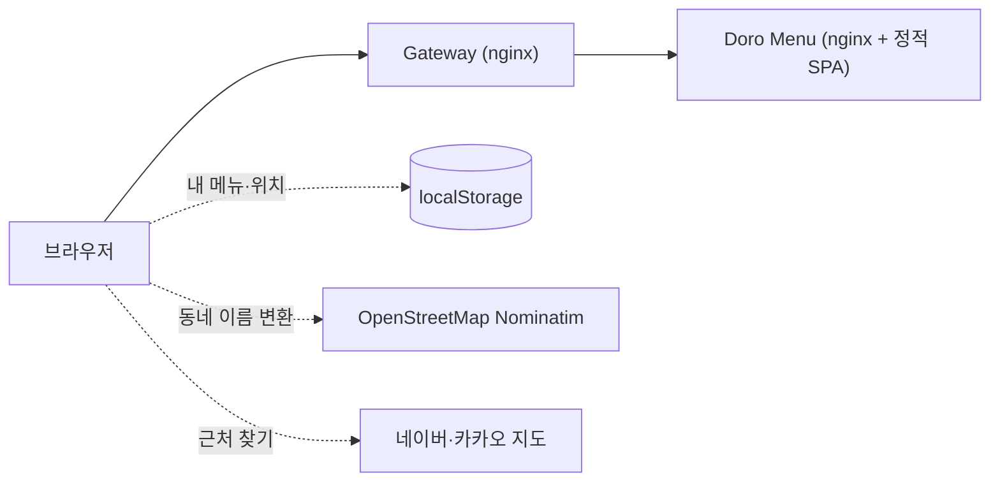

# 🍽️ Doro Menu

[](https://github.com/yu-teacher/doro-menu/actions/workflows/ci.yml)

> **English summary** — "What should I eat?" decided for you. A small, backend-less React 19 SPA with three ways to pick a meal (random box, roulette, and a managed menu book) over **123 curated Korean-market menus in 10 categories**, narrated by the mascot of my own platform **[Doro](https://github.com/yu-teacher/doro)**. The engineering focus is on the details that make a tiny product feel finished: versioned `localStorage` migration that preserves users' custom menus, a menu-name → map-search-keyword normalizer so the "find it nearby" button actually returns results, a geolocation flow that degrades gracefully (insecure context, denied permission, offline reverse-geocoding), analytics that can never break the app, and a CI + multi-stage Docker + nginx cache policy that makes releases instant.

오늘 뭐 먹지? 고민되는 순간을 끝내 주는 **메뉴 결정 서비스**입니다. 서버 없이 브라우저에서만 동작하고, 직접 만든 인증·인가 플랫폼 **[Doro](https://github.com/yu-teacher/doro)**의 마스코트 "도로롱"이 결과를 안내합니다.

| | |
|---|---|
| **🎁 박스 뽑기** | 활성화한 메뉴 중 하나를 무작위로 뽑고, 마음에 안 들면 다시 뽑기(리롤) |
| **🎡 룰렛** | 메뉴를 룰렛에 올려 돌리기. 회차 제한과 애니메이션 포함 |
| **📖 메뉴판** | **123종** 기본 메뉴(10개 카테고리)를 켜고 끄고, 내 메뉴 추가·삭제, 기본값 복원 |
| **📍 근처 찾기** | 결과 메뉴를 네이버·카카오 지도 검색으로 바로 연결 (GPS 또는 동네 직접 입력) |
| **🖼️ 도로 갤러리** | 상황별 표정 41종과 갤러리 55장 |

---

## 🧠 설계에서 신경 쓴 것

### 1. 사용자 데이터를 잃지 않는 저장소 마이그레이션
메뉴 목록은 `localStorage`에 버전 키(`v1` → `v2`)로 저장합니다. 기본 메뉴가 늘어난 새 버전에서도 **예전 버전 사용자가 직접 추가한 메뉴는 추려서 새 기본 메뉴 앞에 합칩니다.** 저장소 접근은 `StorageService` 인터페이스 뒤에 두어, 저장 방식이 바뀌어도 화면 코드는 그대로입니다. 읽기·쓰기 실패(용량 초과, 차단된 저장소)는 예외로 앱을 멈추지 않고 기본 메뉴로 안전하게 동작합니다.

### 2. "근처 찾기" 버튼이 실제로 결과를 내도록: 검색어 정규화
메뉴 이름은 사람이 읽기 좋게 쓴 문구입니다(`뼈해장국 / 감자탕`, `보쌈 & 무말랭이 정식`). 그대로 지도에 검색하면 결과가 빈약하거나 비어 있습니다. 그래서 세 단계로 지도용 키워드를 정합니다.

1. 메뉴에 지정된 `searchKeyword`가 있으면 그것을 사용
2. 대표 메뉴 사전(`KNOWN_SEARCH_KEYWORDS`)에서 지도 검색이 가장 잘 되는 대표어로 변환 (`뼈해장국 / 감자탕` → `감자탕`)
3. 사전에 없는 사용자 메뉴는 구분 기호·괄호·수식어를 제거해 정리

### 3. 위치 권한이 없어도 쓸 수 있게: 단계적 대체 흐름
GPS는 사용자가 버튼을 눌렀을 때만 요청합니다. 브라우저가 지원하지 않거나, **HTTP 같은 비보안 환경에서 차단되거나**, 권한을 거부해도 오류 화면 대신 동네를 직접 선택·입력하는 흐름으로 이어집니다. 좌표는 오픈 리버스 지오코딩(OpenStreetMap Nominatim)으로 동네 이름으로 바꾸고, 이 변환이 실패해도 네이버 지도는 좌표를 중심으로 열립니다. 위치는 이 브라우저(`localStorage`)에만 저장되며, 자체 서버로는 보내지 않습니다.

### 4. 분석이 서비스를 망가뜨리지 않게
GA4 이벤트 전송 유틸은 `gtag`가 없을 때(광고 차단기 등)도 아무 일 없이 지나가고, `undefined` 값은 제거한 뒤 보냅니다. 탭 이동, 룰렛 회차, 지도 제공자 선택, 커스텀 메뉴 추가 같은 **제품 핵심 행동**만 계측합니다.

### 5. 배포와 캐시 전략
- **CI**: `main` 푸시와 PR마다 타입 검사·프로덕션 빌드·Docker 이미지 빌드를 확인합니다.
- **Docker 멀티 스테이지**: Node에서 빌드한 정적 파일만 nginx 이미지에 담아 최종 이미지를 작게 유지합니다.
- **nginx 캐시 정책**: 해시가 붙은 JS·CSS는 1년 캐시, 이미지는 7일, **HTML은 캐시하지 않아** 새 버전이 즉시 반영됩니다. SPA 라우팅은 `index.html`로 폴백합니다.

---

## 🏗️ 구조



서버·DB가 없는 순수 클라이언트 앱이고, Doro 플랫폼의 게이트웨이 뒤에서 정적 파일로 서비스됩니다. Doro의 로그인·권한 기능은 쓰지 않습니다(로그인이 필요 없는 서비스입니다).

**기술 스택** React 19 · TypeScript 5.7 · Vite 6 · Tailwind CSS 4 · nginx · Docker · GitHub Actions

```text
src/
├─ components/   박스 뽑기, 룰렛, 메뉴판, 결과 카드, 갤러리, 표정 반응
├─ constants/    기본 메뉴 123종, 도로 표정·갤러리 자산 목록
├─ hooks/        useUserLocation (GPS → 동네 이름, 대체 흐름)
├─ services/     menuStorage (버전 키 저장소, 마이그레이션)
├─ utils/        searchKeyword (지도 검색어 정규화), analytics (GA4)
└─ types/        MenuItem, 카테고리, 표정(DoroEmotion) 타입
```

## 🚀 실행

```bash
npm ci
npm run dev        # 개발 서버
npm run build      # 타입 검사 + 프로덕션 빌드 (dist/)
docker build -t doro-menu .   # nginx 로 서비스하는 이미지
```

## 📚 함께 보기
| | |
|---|---|
| [Doro](https://github.com/yu-teacher/doro) | 이 서비스가 속한 인증·인가 플랫폼 (Zanzibar 방식 ReBAC 엔진 Guard 포함) |
| [Doro Blog](https://github.com/yu-teacher/doro-blog) | Doro 위에서 동작하는 기술 블로그 서비스 |
